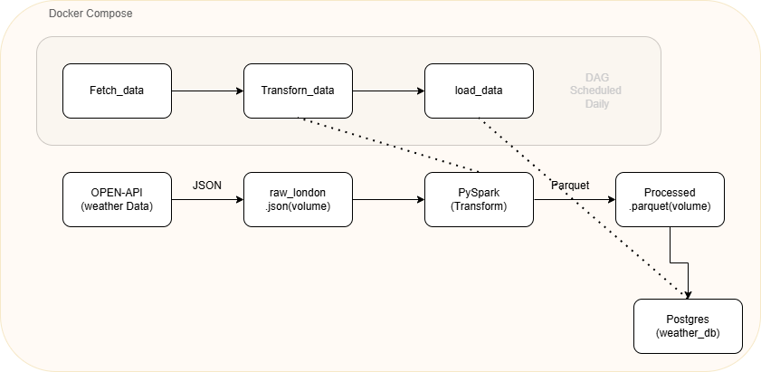

# Weather ETL Pipeline 🌦️

An automated end-to-end data pipeline that ingests daily weather data from a public REST API, transforms it with PySpark, and loads it into PostgreSQL — fully orchestrated by Apache Airflow and containerized with Docker Compose.

---

## Architecture



```
Open-Meteo API  →  raw JSON  →  PySpark (local)  →  Parquet  →  PostgreSQL
                        ↑               ↑                             ↑
                   fetch_data    transform_data                  load_data
                   [Task 1]        [Task 2]                      [Task 3]
                        └───────── Airflow DAG (@daily) ──────────────┘
                                  Docker Compose
```

**Data flow:**
1. Airflow triggers `fetch_data` → calls Open-Meteo API → saves raw JSON to a shared Docker volume
2. Airflow triggers `transform_data` → PySpark reads JSON, explodes parallel arrays into rows, writes Parquet
3. Airflow triggers `load_data` → reads Parquet with pandas, upserts rows into PostgreSQL

---

## Tech Stack

| Layer           | Tool                        |
|-----------------|-----------------------------|
| Orchestration   | Apache Airflow 2.8          |
| Processing      | PySpark 3.5 (local mode)    |
| Storage         | PostgreSQL 15               |
| Language        | Python 3.11                 |
| Containerization| Docker + Docker Compose     |
| Data source     | Open-Meteo API (free, no key required) |

---

## Project Structure

```
weather-etl/
├── dags/
│   └── weather_pipeline.py    # Airflow DAG with 3 tasks
├── spark_jobs/
│   └── transform.py           # PySpark transformation script
├── sql/
│   ├── 01_create_weather_db.sql
│   └── 02_create_table.sh
├── data/                      # Shared volume (raw JSON + Parquet output)
├── logs/                      # Airflow logs
├── plugins/                   # Airflow plugins (empty)
├── Dockerfile                 # Custom Airflow image with Java + PySpark
├── docker-compose.yml
├── requirements.txt
└── README.md
```

---

## Getting Started

### Prerequisites
- [Docker Desktop](https://www.docker.com/products/docker-desktop/) installed and running
- At least 4GB RAM allocated to Docker

### Run the pipeline

```bash
# 1. Clone the repo
git clone https://github.com/YOUR_USERNAME/weather-etl.git
cd weather-etl

# 2. First-time setup: initialize Airflow DB and create admin user
docker compose up airflow-init

# 3. Start all services
docker compose up -d

# 4. Open Airflow UI
open http://localhost:8080
# Login: admin / admin

# 5. Trigger the DAG manually (or wait for the daily schedule)
docker compose exec airflow-webserver airflow dags trigger weather_etl_pipeline
```

### Verify the data loaded

```bash
docker compose exec postgres psql -U airflow -d weather_db \
  -c "SELECT * FROM weather_data ORDER BY date DESC LIMIT 10;"
```

Expected output:
```
 city   |    date    | temperature_max | temperature_min | precipitation
--------+------------+-----------------+-----------------+---------------
 London | 2026-05-19 |            18.2 |            11.4 |           0.0
 London | 2026-05-18 |            16.7 |            10.1 |           1.2
 ...
```

### Stop everything

```bash
docker compose down        # stop containers (keeps data)
docker compose down -v     # stop containers + wipe volumes (fresh start)
```

---

## Database Schema

```sql
CREATE TABLE weather_data (
    id              SERIAL PRIMARY KEY,
    city            VARCHAR(100)    NOT NULL,
    date            DATE            NOT NULL,
    temperature_max NUMERIC(5,2),
    temperature_min NUMERIC(5,2),
    precipitation   NUMERIC(6,2),
    windspeed_max   NUMERIC(5,2),
    ingested_at     TIMESTAMP       DEFAULT NOW(),
    UNIQUE(city, date)              -- safe for daily re-runs
);
```

---

## Key Design Decisions

- **PySpark in local mode** — runs embedded inside the Airflow container, removing the need for a separate Spark cluster for a single-node pipeline.
- **`arrays_zip` + `explode`** — Open-Meteo returns data as parallel arrays (`dates[]`, `temp_max[]`, ...). This Spark pattern efficiently converts them into proper rows without a UDF.
- **Idempotent upserts** — `INSERT ... ON CONFLICT (city, date) DO NOTHING` means the DAG can be re-triggered safely without creating duplicates.
- **Docker volumes** — raw JSON and Parquet files are written to a shared volume, decoupling the fetch, transform, and load steps so each task can fail and retry independently.
- **Custom Dockerfile** — extends the official Airflow image with Java (required by PySpark) and Python dependencies baked in.

---

## Extending This Project

- Add more cities by parameterizing the DAG with Airflow variables
- Add a data quality check task between transform and load (e.g. row count validation)
- Replace local Parquet storage with S3 or GCS for cloud-native storage
- Add a Grafana dashboard connected to PostgreSQL to visualize the weather trends
- Schedule with `@hourly` and switch to the Open-Meteo forecast endpoint for real-time data

---

## License

MIT
